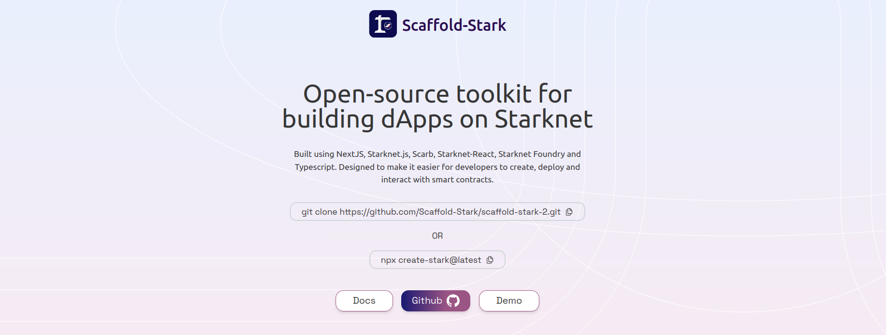

<h1 align="center">Scaffold Stark</h1>

Scaffold-Stark is an open-source, up-to-date toolkit for building decentralized applications (dapps) on the Starknet blockchain. It's designed to make it easier for developers to create and deploy smart contracts and build user interfaces that interact with those contracts. Scaffold-Stark is a UI-agnostic framework, meaning it does not enforce any specific UI framework or library, giving developers the flexibility to choose their preferred UI tools and libraries.

---

## 🚀 Tools and Features
- [Starknet-Devnet-rs](https://github.com/0xSpaceShard/starknet-devnet-rs): Local Starknet network for testing.
- [Scarb](https://docs.swmansion.com/scarb/): Build and compile smart contracts.
- [StarknetJS](https://www.starknetjs.com/docs/guides/intro): Low-level interface for interacting with Starknet smart contracts.
- [Starknet-React](https://starknet-react.com/docs/getting-started): React hooks for simplifying smart contract interactions.
- [NextJS](https://nextjs.org/docs): Framework for building modern frontend applications with pre-made hooks.

Feel free to explore, contribute, and build with Scaffold-Stark!
